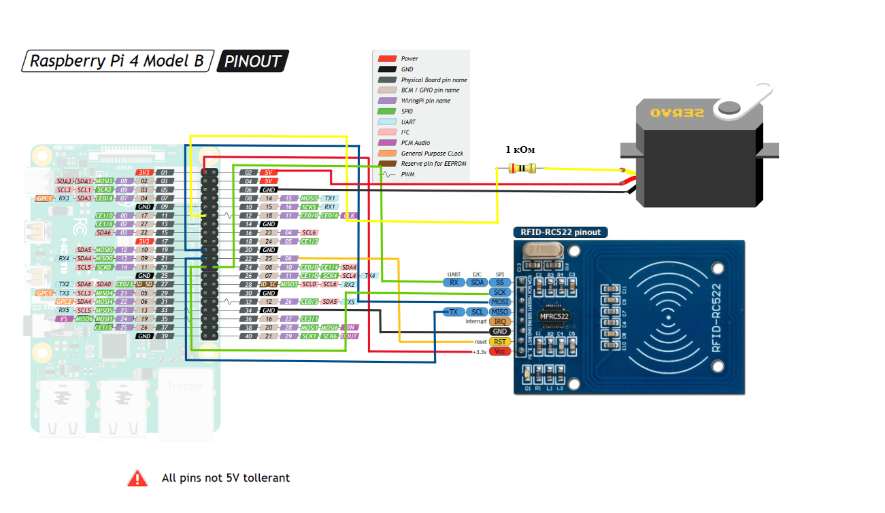
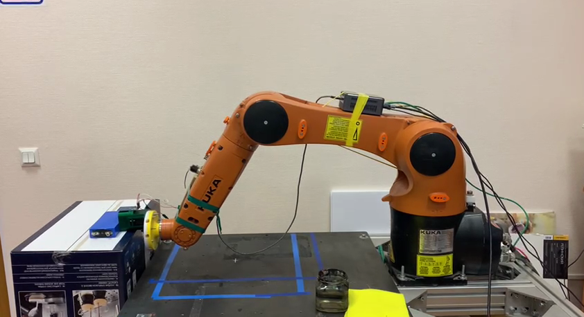

# Manipulator-SmartTool
**Цель проекта:**

Разработать систему смены и распознования схватов на манипуляторе.

**Задачи проекта:**

1. Разработать надежную механику крепления для различных схватов.  
2. Создать программу для связи контроллера манипулятора и схвата.
3. Передавать сведения о схвате (пока - размер схата и тип) на управляющее устройство в режиме реального времени.

**Описание:**

Наш манипулятор должен уметь менять различные схваты для различных задач. При этом, между ним и схватом должен происходить обмен данными,
чтобы манипулятор мог распознать схват.

**Комплектующие:**

[NFC reader: RFID-модуль RC522](https://roboshop.spb.ru/modules/rfid-rc522)
 (помимо RFID меток, он также может читать NFC метки)

[Сервопривод: MG996 (360 град.)]((https://aliexpress.ru/item/32961323909.html?spm=a2g0s.9042311.0.0.264d33edEaSG71))

[Raspberry Pi 4](https://aliexpress.ru/catalog/raspberry-pi-3b.html?spm=a2g0s.9042311.0.0.264d33edVjjP0A)


**Запуск Ros на Raspberry**

В нашем проекте используется Raspberry Pi 4 (версия 2 Gb)
Для запуска нескольких node при условии одного подключения
к Raspberry Pi, мы используем roslaunch

```
roslaunch nfc_rfid nfc.launch 
```
Для визуализации выходных данных нужно использовать команду

```
roslaunch nfc_rfid nfc.launch --screen
```
roslaunch файл выводит данные о нашей NFC метке, если метки нет, выводится 0.
Для инициализации node, управляющей сервоприводом, запускается файл servo.py
```
rosrun nfc_rfid servo.py
```
Далее запустим консоль для работы с сервоприводом, где мы можем посылать команды Close (для закрытия держателя схвата) и Open (для открытия держателя схвата), а также exit (для выхода из консоли)
```
rosrun nfc_rfid cmd.py
```
Подключение пинов:


**Печать 3д моделей**

Модели для печати лежат в папке ./models в формате .stl, а также в .f3z - формат для Fusion 360, если вы захотите изменить модель для себя.

**Результат:**

В результате наших тестов мы смогли сделать так, что при схват может закрыться автоматически при обнаружении NFC метки по истечению определенного времени или мы можем его закрыть, послав команду Close в node cmd.py. Для его открытия мы можем послать команду Open в тот же файл cmd.py.
Испытания проводились на манипуляторе CUCA KR6 R900

